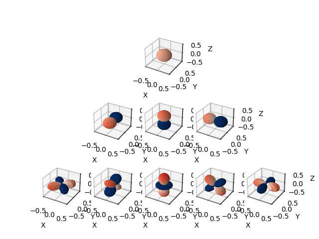
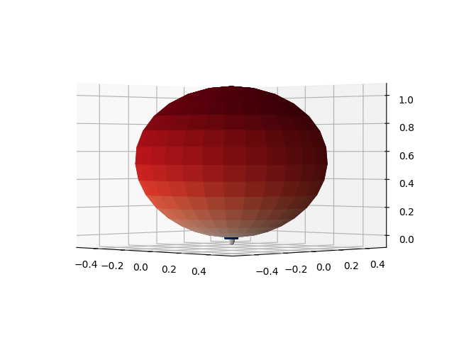
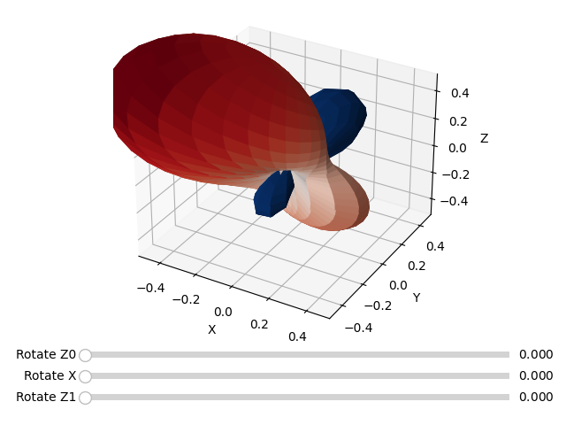
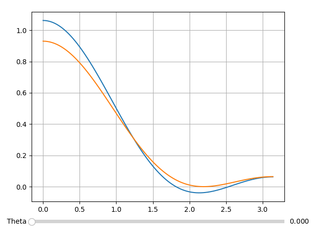

# SH Lab

Some numeric experiments with sperical harmonics.

## Requirements

+ Python 3.9
+ matplotlib
+ numpy

## Visualizing Basis

```python
plot_basis()
```



## Visualize SH2

Negative values are painted blue.

### Plot Surface

```python
plot_sh(s, rotate=False, fixed_range=None)
```

Example: Plot a delta function convolved with cosine lob

```python
plot_sh(conv_zonal(eval_sh(0, 0, 1), cos_lob_zonal()))
```



ZXZ Euler angle slider can be showned by setting `rotate=True`. These sliders do actual transform on the SH components rather than the visualization viewport.

Range of axes can use a given fixed value.

```python
plot_sh(np.random.rand(9), True, 0.5)
```



### Plot Value

```python
plot_2d_sh(s, phi_min, phi_max)
```

Example: Plot a delta function convolved with cosine lob and a deringed one without negative value

```python
delta = conv_zonal(eval_sh(0, 0, 1), cos_lob_zonal())
plot_2d_sh((delta, deringing(delta)), 0, PI)
```



## Algorithm

The main purpose of this repo is to implement the paper 'Deringing Spherical Harmonics' by Peter-Pike Sloan. The paper presents a fast algorithm to automatically compute the window size for deringing by estimating a conservative lower bound of SH2.

The SH rotation is done in a similar way to this [blog](http://filmicworlds.com/blog/simple-and-fast-spherical-harmonic-rotation/). My code does no optimization for OP count, though.